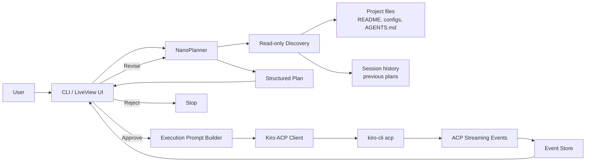
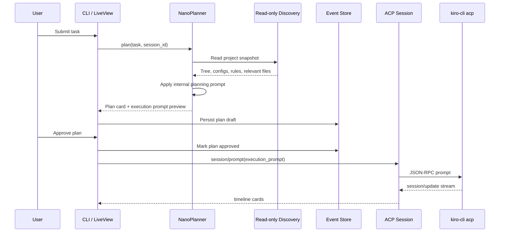
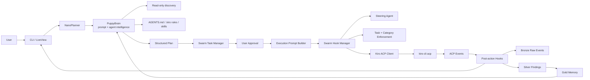
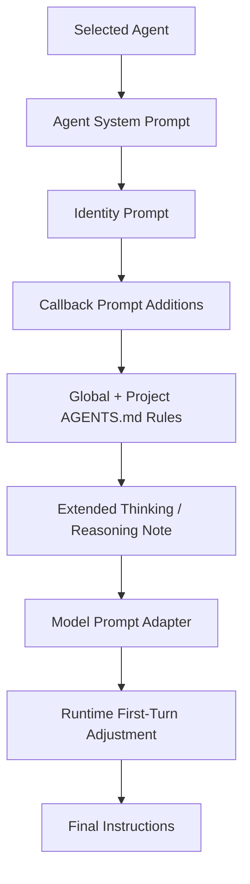
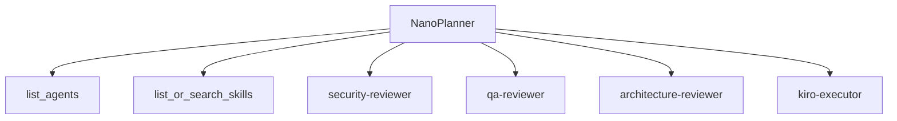
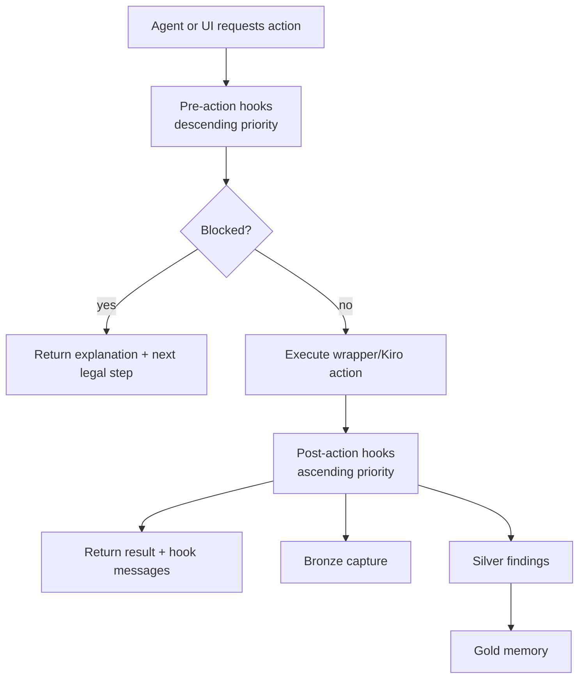
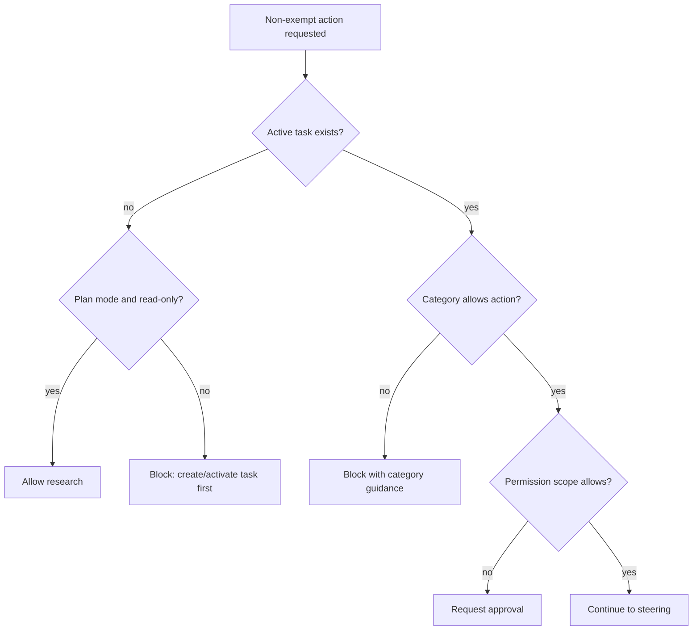
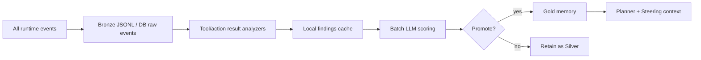
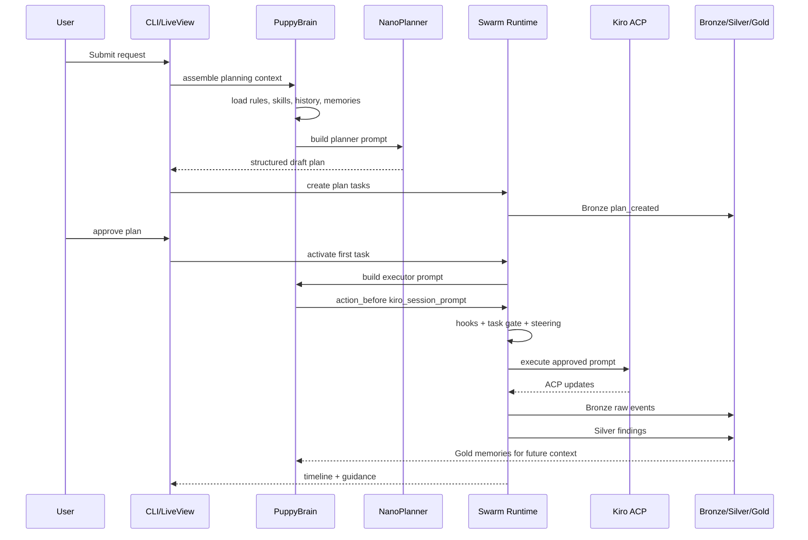

# Plan 3 — NanoPlanner + PuppySwarm Deterministic Swarm Extension for `kiro_cockpit`

**Date:** 2026-04-25  
**Input plan:** `plan2.md`  
**Additional inputs:** `code_puppy_analysis_report.md`, `code_puppy-main.zip`, `swarm-sdk-architecture.pdf`  
**Working name:** `kiro_cockpit`  
**New extension:** `PuppySwarm`  
**Goal:** extend Plan 2 with Code Puppy intelligence and Swarm SDK enforcement so the cockpit can plan, task, steer, execute, audit, and remember work deterministically.

---

## How to read this file

Part A preserves the Plan 2 NanoPlanner baseline. Part B extends it with the new PuppySwarm design: Code Puppy-style prompt/agent/tool intelligence plus Swarm SDK hook, task, steering, and memory architecture.

---

# Part A — Plan 2 Baseline, Preserved and Retained

## Plan 2 baseline — Nano Planner Extension for `kiro_cockpit`

**Date:** 2026-04-25  
**Input plan:** `kiro_plan.md`  
**Working name:** `kiro_cockpit`  
**New extension:** `NanoPlanner`  
**Goal:** add a small but powerful planning layer that borrows the best ideas from Code Puppy’s planning system and uses them to produce safer, clearer, approval-gated execution plans before Kiro runs implementation work.

---

## 0. What changed from the original plan

The original `kiro_plan.md` is strong on ACP transport, permissions, LiveView timelines, and wrapper architecture. The missing piece is an explicit **planning brain** that sits above Kiro and turns a raw user request into a grounded execution plan.

This `plan2.md` adds that missing layer:

```text
User request
  -> NanoPlanner read-only discovery
  -> NanoPlanner internal planning prompt
  -> structured plan preview
  -> user approval
  -> Kiro ACP execution prompt
  -> timeline/tool/permission tracking
```

The most important design improvement is a **two-stage planning gate**:

```text
Stage A — Discovery + plan
  Allowed: read-only project scan, config detection, grep/search, ask clarification.
  Not allowed: file writes, shell commands with side effects, terminal execution, implementation.

Stage B — Execution
  Allowed only after user approves the plan.
  Kiro receives a precise execution prompt generated from the approved plan.
```

This fixes a weakness found in Code Puppy’s planning prompt: it asks the planner to “explore first,” but also says not to invoke tools until approval. In `NanoPlanner`, the rule is clearer:

> Read-only discovery is allowed before approval. Mutating work requires approval.

---

## 1. Product concept

`NanoPlanner` is a lightweight planning module inside `kiro_cockpit`.

It does **not** replace Kiro. It prepares Kiro.

```text
Kiro = execution engine
NanoPlanner = planning brain
kiro_cockpit = orchestration, UI, permissions, persistence, timeline
```

### Core idea

Before a user prompt is sent directly to Kiro, the wrapper can run it through a hidden planning prompt that produces:

1. a short objective,
2. project understanding,
3. execution phases,
4. exact files/components likely involved,
5. risks,
6. permission-sensitive steps,
7. a Kiro-ready execution prompt, and
8. approval controls for the user.

The user sees the plan. Kiro receives the execution prompt only after approval.

---

## 2. Why this will make planning feel “amazing”

The planning quality comes from architecture, not magic.

Borrowed from Code Puppy’s best design patterns:

| Code Puppy pattern | NanoPlanner adaptation |
|---|---|
| Dedicated Planning Agent | Dedicated `NanoPlanner` mode/module |
| Strong planning system prompt | `priv/prompts/nano_planner_system_prompt.md` |
| Explore project before planning | Read-only discovery snapshot before plan |
| Structured output format | JSON plan + markdown plan card |
| Agent coordination | Kiro execution handoff + optional specialist agents later |
| Tool-aware reasoning | Plan marks required tools and permission level |
| Session history | Store plan snapshots and decisions |
| Approval gate | Plan first, execute only after user approval |
| Project rules | Include `.kiro`, `AGENTS.md`, README, config files |
| Runtime prompt wrapper | Generate Kiro-specific execution prompt from approved plan |

The result should feel like this:

```text
User: “Build a Phoenix LiveView dashboard for Kiro sessions.”

NanoPlanner:
  - inspects project shape,
  - identifies Phoenix/LiveView boundaries,
  - separates transport, persistence, UI, permission work,
  - warns about ACP turn-completion edge cases,
  - proposes phases,
  - creates a Kiro execution prompt.

User: “approve”

Kiro:
  - receives a clean implementation brief instead of vague instructions.
```

---

## 3. High-level architecture with NanoPlanner



### Runtime lifecycle



---

## 4. NanoPlanner modes

### 4.1 `nano` mode

Fast, compact, and cheap.

Use this for normal planning:

```text
/nano "Add login with GitHub OAuth"
```

Output:

- objective,
- project snapshot,
- 3 to 5 phases,
- risks,
- acceptance criteria,
- execution prompt.

### 4.2 `nano-deep` mode

More careful, still approval-gated.

Use when the work is architectural, risky, or ambiguous:

```text
/nano-deep "Refactor ACP session handling and permissions"
```

Extra output:

- alternatives,
- dependency graph,
- migration strategy,
- rollback plan,
- test matrix.

### 4.3 `nano-fix` mode

Small repair planner.

Use when Kiro or the app has an error:

```text
/nano-fix "The turn completion logic finishes too early"
```

Output:

- suspected cause,
- files to inspect,
- minimal patch plan,
- regression test plan.

---

## 5. Internal NanoPlanner system prompt

Create:

```text
priv/prompts/nano_planner_system_prompt.md
```

Recommended prompt:

```markdown
# NanoPlanner System Prompt

You are NanoPlanner, a compact strategic planning specialist inside `kiro_cockpit`.

Your job is to convert a user request into a clear, safe, implementation-ready plan before Kiro performs execution.

You are not the implementer during planning mode. You are the planner, reviewer, and risk analyst.

## Core behavior

1. Understand the user's objective.
2. Use read-only project context to ground the plan.
3. Identify the likely files, modules, routes, schemas, tools, and permission boundaries involved.
4. Break the work into phases that can be executed sequentially.
5. Mark which steps require read-only access, write access, shell access, terminal access, or external tools.
6. Identify risks, blockers, and missing information.
7. Ask a clarification question only if the plan would be unsafe or badly wrong without it.
8. Produce a concise plan that the user can approve.
9. Produce a Kiro-ready execution prompt that can be sent after approval.

## Strict safety boundary

Before user approval:
- You may use read-only context supplied by the wrapper.
- You may reason about files and architecture.
- You may ask clarification questions.
- You must not request file writes.
- You must not request shell commands with side effects.
- You must not execute implementation.

After user approval:
- The wrapper may send your generated execution prompt to Kiro.
- Kiro and the wrapper permission system handle tool approvals.

## Read-only discovery policy

Treat the provided project snapshot as the source of truth.
Prefer concrete file names and modules over generic advice.
If the snapshot is incomplete, say what should be inspected next.

## Planning style

Be specific, practical, and sequential.
Prefer small reversible steps.
Separate foundation, implementation, integration, testing, and hardening.
Include validation steps for every phase.
Call out permission-sensitive actions.
Call out ACP-specific risks when relevant.

## Output contract

Return both:

1. `plan_markdown`: a user-facing plan.
2. `execution_prompt`: a precise prompt for Kiro to execute after approval.

The plan must use this structure:

🎯 OBJECTIVE
📊 PROJECT SNAPSHOT
🧭 ASSUMPTIONS
📋 EXECUTION PLAN
🔐 PERMISSIONS NEEDED
✅ ACCEPTANCE CRITERIA
⚠️ RISKS AND MITIGATIONS
🔁 ALTERNATIVES
🚀 KIRO EXECUTION PROMPT PREVIEW

The execution prompt must be direct, implementation-focused, and include:
- objective,
- files/modules to inspect first,
- ordered tasks,
- constraints,
- tests to run,
- when to stop and ask for permission or clarification.

Do not hide uncertainty. If something is inferred, label it as an inference.
```

### Why this prompt is better than a generic planning prompt

It forces the model to think in this order:

```text
objective
  -> project facts
  -> assumptions
  -> phases
  -> permissions
  -> validation
  -> risks
  -> execution handoff
```

It also gives the app a clean product behavior:

```text
Plan is visible.
System prompt is hidden.
Execution is approval-gated.
Kiro receives precise instructions.
```

---

## 6. Runtime prompt wrapper

Create:

```text
priv/prompts/nano_runtime_wrapper.md
```

Template:

```markdown
# NanoPlanner Runtime Input

## User request

{{user_request}}

## Session context

{{session_summary}}

## Project snapshot

{{project_snapshot}}

## Existing app plan

{{kiro_plan_summary}}

## Current mode

{{mode}}

## Output format

Return a JSON object matching `NanoPlanner.PlanSchema`.
Also include `plan_markdown` and `execution_prompt` as strings.
```

The app should not expose this wrapper directly to the user. It is used to feed structured context into the planner.

---

## 7. Plan output schema

Create an internal schema so the UI and execution layer do not parse free text.

### JSON shape

```json
{
  "id": "plan_01",
  "mode": "nano",
  "status": "draft",
  "objective": "Build ACP timeline view",
  "summary": "Add a LiveView timeline that renders session/update events as cards.",
  "assumptions": [
    "Phoenix LiveView is already part of the app."
  ],
  "project_snapshot": {
    "project_type": "Phoenix application",
    "key_files": [
      "lib/kiro_cockpit_web/router.ex",
      "lib/kiro_cockpit/event_store.ex"
    ],
    "detected_stack": ["Elixir", "Phoenix", "LiveView", "PostgreSQL"]
  },
  "phases": [
    {
      "number": 1,
      "title": "Foundation",
      "steps": [
        {
          "title": "Create timeline event schema",
          "details": "Add normalized timeline event fields.",
          "files": ["lib/kiro_cockpit/event_store.ex"],
          "permission": "write",
          "validation": "Unit test event normalization."
        }
      ]
    }
  ],
  "permissions_needed": ["read", "write"],
  "acceptance_criteria": [
    "Session updates appear as ordered timeline cards."
  ],
  "risks": [
    {
      "risk": "ACP prompt response may return before turn is complete.",
      "mitigation": "Use session/update turn-end event for completion."
    }
  ],
  "alternatives": [
    {
      "name": "Timeline from raw ACP only",
      "pros": ["Simpler MVP"],
      "cons": ["Harder UX"]
    }
  ],
  "execution_prompt": "Implement the approved plan..."
}
```

### Elixir schema module

Create:

```text
lib/kiro_cockpit/nano_planner/plan_schema.ex
```

Sketch:

```elixir
defmodule KiroCockpit.NanoPlanner.PlanSchema do
  @moduledoc """
  Normalized planning output from NanoPlanner.

  This is intentionally independent from raw model output so the UI,
  persistence layer, and Kiro execution handoff all use the same shape.
  """

  @required_keys [
    :objective,
    :summary,
    :phases,
    :permissions_needed,
    :acceptance_criteria,
    :risks,
    :execution_prompt
  ]

  def validate!(plan) when is_map(plan) do
    missing =
      @required_keys
      |> Enum.reject(&Map.has_key?(plan, Atom.to_string(&1)))

    case missing do
      [] -> plan
      _ -> raise ArgumentError, "NanoPlanner output missing keys: #{inspect(missing)}"
    end
  end
end
```

---

## 8. Read-only discovery module

Create:

```text
lib/kiro_cockpit/nano_planner/context_builder.ex
```

Responsibilities:

1. detect project type,
2. list top-level files,
3. read safe config files,
4. read project rules,
5. summarize recent session history,
6. include the existing `kiro_plan.md` summary when present,
7. never mutate project files.

### Files safe to read by default

```text
README.md
AGENTS.md
AGENT.md
package.json
pyproject.toml
mix.exs
Cargo.toml
go.mod
deno.json
pnpm-lock.yaml
uv.lock
.kiro/*
config/config.exs
lib/*_web/router.ex
```

### Context budget

Keep discovery compact:

```text
max_tree_lines: 200
max_file_chars_per_file: 6_000
max_total_context_chars: 40_000
```

### Context format

```markdown
# Project Snapshot

## Root files
...

## Detected stack
...

## Important config excerpts
...

## Existing plans
...

## Session summary
...
```

---

## 9. NanoPlanner service module

Create:

```text
lib/kiro_cockpit/nano_planner.ex
```

Sketch:

```elixir
defmodule KiroCockpit.NanoPlanner do
  alias KiroCockpit.NanoPlanner.{ContextBuilder, PromptBuilder, PlanSchema}
  alias KiroCockpit.EventStore

  def plan(session, user_request, opts \\ []) do
    mode = Keyword.get(opts, :mode, :nano)

    with {:ok, snapshot} <- ContextBuilder.build(session, user_request, mode),
         {:ok, prompt} <- PromptBuilder.build(user_request, snapshot, mode),
         {:ok, raw_plan} <- run_planner_model(session, prompt, mode),
         plan <- PlanSchema.validate!(raw_plan),
         {:ok, saved_plan} <- EventStore.save_plan(session, plan) do
      {:ok, saved_plan}
    end
  end

  def approve(session, plan_id) do
    with {:ok, plan} <- EventStore.approve_plan(session, plan_id) do
      KiroCockpit.KiroSession.prompt(session, plan["execution_prompt"])
    end
  end

  def revise(session, plan_id, revision_request) do
    with {:ok, old_plan} <- EventStore.get_plan(session, plan_id) do
      plan(session, """
      Revise this plan according to the user request.

      User revision:
      #{revision_request}

      Previous plan:
      #{old_plan["plan_markdown"]}
      """)
    end
  end
end
```

### Planner model options

The first implementation can use one of two paths.

#### Option A — Kiro custom planning agent

Use Kiro itself as the planner by creating a custom Kiro agent with the NanoPlanner system prompt.

Pros:
- fewer model integrations,
- reuses Kiro auth/model config,
- closer to the final execution environment.

Cons:
- planning and execution are both inside Kiro,
- harder to guarantee strict separation unless session/tool permissions are carefully controlled.

#### Option B — wrapper-owned planner model

Use a small direct model call from `kiro_cockpit` for planning only.

Pros:
- clearer separation,
- easier structured JSON enforcement,
- easier to run with a cheap/fast model.

Cons:
- more provider integration work,
- model keys must be managed by the wrapper.

### Recommended MVP choice

Use **Option A first**, but launch it in read-only planning mode:

```bash
kiro-cli acp --agent kiro-cockpit-nano-planner
```

Then use normal Kiro agent sessions for execution.

---

## 10. Kiro custom agent config

Create a project-local agent config.

Example path:

```text
.kiro/agents/kiro-cockpit-nano-planner.json
```

Example:

```json
{
  "name": "kiro-cockpit-nano-planner",
  "description": "Read-only NanoPlanner used by kiro_cockpit to create approval-gated implementation plans.",
  "prompt": "file://./priv/prompts/nano_planner_system_prompt.md",
  "tools": ["read", "grep"],
  "allowedTools": ["read", "grep"],
  "includeMcpJson": false,
  "model": "claude-sonnet-4"
}
```

Execution agent config remains separate:

```json
{
  "name": "kiro-cockpit-executor",
  "description": "Execution agent controlled by approved NanoPlanner plans.",
  "prompt": "file://./priv/prompts/kiro_executor_system_prompt.md",
  "tools": ["read", "write", "shell"],
  "allowedTools": ["read"],
  "includeMcpJson": true,
  "model": "claude-sonnet-4"
}
```

Key rule:

```text
Planner agent: read-only.
Executor agent: approval-gated write/shell.
```

---

## 11. LiveView UI extension

Add a planning panel before the normal Kiro timeline.

### Route

```elixir
live "/sessions/:id/plan", SessionPlanLive
```

### Page layout

```text
+--------------------------------------------------+
| User Request                                     |
| [textarea]                                       |
| Mode: nano | nano-deep | nano-fix                |
| [Generate Plan]                                  |
+--------------------------------------------------+

+--------------------------------------------------+
| NanoPlanner Plan                                 |
| Objective                                        |
| Project Snapshot                                 |
| Phases                                           |
| Permissions Needed                               |
| Risks                                            |
| Acceptance Criteria                              |
| Execution Prompt Preview                         |
| [Approve & Run in Kiro] [Revise] [Reject]        |
+--------------------------------------------------+

+--------------------------------------------------+
| Kiro Execution Timeline                          |
| tool calls, permission requests, messages        |
+--------------------------------------------------+
```

### Plan card states

```text
draft
approved
running
completed
rejected
superseded
failed
```

### Timeline additions

Add new normalized event types:

```text
nano_plan_created
nano_plan_revised
nano_plan_approved
nano_plan_rejected
nano_execution_started
```

---

## 12. CLI extension

Add commands:

```text
/nano <task>
/nano-deep <task>
/nano-fix <problem>
/plans
/plan show <id>
/plan approve <id>
/plan revise <id> <request>
/plan reject <id>
/plan run <id>
```

Example CLI flow:

```text
kiro-cockpit> /nano Add GitHub OAuth login

NanoPlanner created plan plan_20260425_001

🎯 OBJECTIVE
Add GitHub OAuth login...

📋 EXECUTION PLAN
Phase 1: Auth foundation
Phase 2: OAuth callback
Phase 3: UI integration
Phase 4: Tests

🔐 PERMISSIONS NEEDED
read, write, shell(test only)

Approve?
  [a] approve and run
  [r] revise
  [x] reject
```

---

## 13. Persistence changes

The original plan already includes event storage. Add planning tables.

### `plans`

| field | type | notes |
|---|---|---|
| `id` | uuid | plan ID |
| `session_id` | uuid | parent session |
| `mode` | string | `nano`, `nano_deep`, `nano_fix` |
| `status` | string | draft/approved/running/completed/etc. |
| `user_request` | text | original task |
| `plan_markdown` | text | rendered plan |
| `execution_prompt` | text | prompt sent to Kiro after approval |
| `raw_model_output` | jsonb | full raw output |
| `project_snapshot_hash` | string | detect stale plans |
| `created_at` | utc_datetime | |
| `approved_at` | utc_datetime | nullable |
| `completed_at` | utc_datetime | nullable |

### `plan_steps`

| field | type | notes |
|---|---|---|
| `id` | uuid | |
| `plan_id` | uuid | |
| `phase_number` | integer | |
| `step_number` | integer | |
| `title` | string | |
| `details` | text | |
| `files` | jsonb | |
| `permission_level` | string | read/write/shell/terminal/external |
| `status` | string | planned/running/done/failed/skipped |
| `validation` | text | |

### `plan_events`

| field | type | notes |
|---|---|---|
| `id` | uuid | |
| `plan_id` | uuid | |
| `event_type` | string | created/revised/approved/etc. |
| `payload` | jsonb | |
| `created_at` | utc_datetime | |

---

## 14. Permission model improvement

The original plan has permission modes. NanoPlanner should add **permission prediction** before execution.

### Permission levels

```text
read          safe project inspection
write         file creation/modification
shell_read    commands like git status, ls, mix test --dry-run if supported
shell_write   commands that generate files, install deps, migrate DB, etc.
terminal      long-running interactive process
external      network, MCP, docs/search, browser
destructive   rm, reset, kill, overwrites, data deletion
```

### Plan display

Every phase should show required permissions:

```text
Phase 2 — Implement OAuth callback
Permissions: write, shell_read
Reason: add controller/live route and run tests
```

### Execution gate

Before running Kiro, the wrapper compares plan permissions with current session policy:

```text
if plan.requires?(:shell_write) and policy == :auto_allow_readonly:
  ask user before running
```

---

## 15. Improved execution prompt handoff

The execution prompt sent to Kiro should be generated from the approved plan, not copied from the user request.

Template:

```markdown
You are executing an approved NanoPlanner plan.

## Objective

{{objective}}

## Constraints

- Follow the approved plan.
- Inspect the listed files before modifying them.
- Do not skip validation.
- Ask for permission before write, shell, terminal, external, or destructive actions according to the wrapper policy.
- If the project state differs from the plan, stop and report the mismatch instead of improvising a risky change.

## Approved phases

{{phases}}

## Files/modules likely involved

{{files}}

## Acceptance criteria

{{acceptance_criteria}}

## Risks to avoid

{{risks}}

## Required validation

{{validation_steps}}

Begin with read-only inspection, then proceed phase by phase.
```

---

## 16. Stale-plan detection

Plans become dangerous if the project changes after planning.

Compute:

```text
project_snapshot_hash = hash(root_tree + config excerpts + relevant file mtimes)
```

Before approval or execution:

```text
if current_snapshot_hash != plan.project_snapshot_hash:
  ask user:
    "Project changed since this plan was created. Regenerate or run anyway?"
```

Recommended behavior:

```text
default = regenerate
```

---

## 17. Testing plan for NanoPlanner

### Unit tests

```text
test context builder respects max context budget
test safe files are read
test unsafe paths are ignored
test plan schema rejects missing execution_prompt
test permission prediction maps steps correctly
test stale-plan hash changes when key files change
```

### Fake planner tests

Use canned model output:

```text
test NanoPlanner.plan/3 saves draft plan
test approve/2 sends execution_prompt to KiroSession
test revise/3 supersedes old plan
```

### LiveView tests

```text
test user can generate plan
test plan card renders phases and permissions
test approve button is disabled when permissions exceed policy
test revise creates new plan version
```

### ACP integration tests

```text
test approved execution prompt reaches fake ACP agent
test Kiro timeline links back to plan_id
test turn completion still waits for session/update turn_end
```

### Regression tests

Especially cover the known long-running-turn risk from the original plan:

```text
session/prompt response != turn complete
turn complete only when turn_end update arrives
```

---

## 18. Implementation phases

### Phase 0 — Keep the original ACP foundation

Keep the original plan’s Phase 0 and Phase 1 mostly unchanged:

- ACP port process,
- JSON-RPC line codec,
- initialize,
- session/new,
- session/prompt,
- session/update handling,
- fake ACP agent.

NanoPlanner depends on a reliable session layer.

### Phase 1 — Add NanoPlanner prompt and schema

Files:

```text
priv/prompts/nano_planner_system_prompt.md
priv/prompts/nano_runtime_wrapper.md
lib/kiro_cockpit/nano_planner.ex
lib/kiro_cockpit/nano_planner/plan_schema.ex
lib/kiro_cockpit/nano_planner/prompt_builder.ex
```

Tasks:

- add prompt files,
- define output schema,
- add prompt builder,
- validate JSON shape,
- store raw output for debugging.

Acceptance:

```text
Given a user task, app creates a valid draft plan with execution_prompt.
```

### Phase 2 — Add read-only context builder

Files:

```text
lib/kiro_cockpit/nano_planner/context_builder.ex
lib/kiro_cockpit/project_snapshot.ex
```

Tasks:

- detect project stack,
- collect safe files,
- summarize `kiro_plan.md` if present,
- enforce context budget,
- hash snapshot.

Acceptance:

```text
NanoPlanner sees a compact, safe project snapshot and no writes occur.
```

### Phase 3 — Add plan persistence

Files:

```text
priv/repo/migrations/*_create_plans.exs
lib/kiro_cockpit/plans/plan.ex
lib/kiro_cockpit/plans/plan_step.ex
lib/kiro_cockpit/plans.ex
```

Tasks:

- create `plans`, `plan_steps`, `plan_events`,
- add status transitions,
- add stale-plan hash,
- link timeline events to plan ID.

Acceptance:

```text
Plans are listed, shown, approved, revised, rejected, and audited.
```

### Phase 4 — Add CLI commands

Files:

```text
lib/kiro_cockpit/cli/commands/nano.ex
lib/kiro_cockpit/cli/commands/plan.ex
```

Tasks:

- `/nano`,
- `/nano-deep`,
- `/nano-fix`,
- `/plan approve`,
- `/plan revise`,
- `/plans`.

Acceptance:

```text
A CLI user can generate a plan, approve it, and run Kiro.
```

### Phase 5 — Add LiveView planning UI

Files:

```text
lib/kiro_cockpit_web/live/session_plan_live.ex
lib/kiro_cockpit_web/components/plan_card.ex
lib/kiro_cockpit_web/components/permission_badge.ex
```

Tasks:

- session plan page,
- plan card,
- permission badges,
- execution prompt preview,
- approve/revise/reject actions.

Acceptance:

```text
A web user can inspect and approve plans before execution.
```

### Phase 6 — Add Kiro custom planner agent

Files:

```text
.kiro/agents/kiro-cockpit-nano-planner.json
.kiro/agents/kiro-cockpit-executor.json
```

Tasks:

- generate or install planner agent config,
- start planning ACP session read-only,
- start execution ACP session separately,
- persist agent version used for each plan.

Acceptance:

```text
Planning uses read-only agent. Execution uses approved executor.
```

### Phase 7 — Add permission prediction and stale-plan checks

Tasks:

- annotate plan steps with permission levels,
- compare with active policy,
- block over-permissioned execution,
- regenerate stale plans by default.

Acceptance:

```text
User cannot accidentally run a write/shell-heavy plan under read-only policy.
```

### Phase 8 — Hardening

Tasks:

- model output repair for malformed JSON,
- retries,
- prompt injection protections for project files,
- redaction,
- audit trail,
- snapshot diff view.

Acceptance:

```text
NanoPlanner is safe enough for normal local development workflows.
```

---

## 19. Suggested repository structure after Plan 2

```text
kiro_cockpit/
  lib/
    kiro_cockpit/
      acp/
        port_process.ex
        line_codec.ex
        json_rpc.ex
      nano_planner/
        context_builder.ex
        plan_schema.ex
        prompt_builder.ex
      nano_planner.ex
      plans.ex
      plans/
        plan.ex
        plan_step.ex
        plan_event.ex
      project_snapshot.ex
      kiro_session.ex
      event_store.ex
      permissions.ex
    kiro_cockpit_web/
      live/
        session_live.ex
        session_plan_live.ex
      components/
        plan_card.ex
        permission_badge.ex
  priv/
    prompts/
      nano_planner_system_prompt.md
      nano_runtime_wrapper.md
      kiro_executor_system_prompt.md
    repo/
      migrations/
  .kiro/
    agents/
      kiro-cockpit-nano-planner.json
      kiro-cockpit-executor.json
```

---

## 20. MVP backlog

Build in this order:

1. ACP core from original plan.
2. Event store for raw ACP messages.
3. NanoPlanner prompt file.
4. Context builder with safe project snapshot.
5. Plan schema validation.
6. Plan persistence.
7. CLI `/nano`.
8. CLI `/plan approve`.
9. Send approved execution prompt to Kiro.
10. LiveView plan card.
11. Permission badges.
12. Stale-plan detection.
13. Fake ACP tests.
14. Fake planner tests.
15. Long-turn regression test.

Minimum lovable MVP:

```text
A user can type /nano <task>, see a strong Code-Puppy-style plan,
approve it, and watch Kiro execute the generated implementation prompt.
```

---

## 21. Example NanoPlanner output

User request:

```text
/nano Build a Phoenix LiveView dashboard that shows Kiro ACP sessions and tool calls.
```

Expected plan:

```markdown
🎯 OBJECTIVE

Create a LiveView dashboard that lists Kiro sessions and renders ACP session updates as timeline cards, including messages, tool calls, permissions, and turn completion.

📊 PROJECT SNAPSHOT

- Project type: Phoenix application
- Important modules:
  - `KiroCockpit.ACP.PortProcess`
  - `KiroCockpit.KiroSession`
  - `KiroCockpit.EventStore`
  - `KiroCockpitWeb.Router`
- Existing risk from plan: `session/prompt` response may arrive before the turn is actually complete.

🧭 ASSUMPTIONS

- Event store already persists raw ACP messages or will be added first.
- Timeline events can be normalized from `session/update`.

📋 EXECUTION PLAN

Phase 1 — Event normalization
- Add normalized timeline event mapping for message chunks, tool calls, permission requests, and turn end.
- Files: `lib/kiro_cockpit/event_store.ex`
- Permission: write
- Validation: unit tests for each ACP update type.

Phase 2 — LiveView route and session list
- Add `/sessions` and `/sessions/:id`.
- Files: router and LiveView modules.
- Permission: write
- Validation: LiveView mount test.

Phase 3 — Timeline cards
- Render agent messages, tool calls, and permissions as separate cards.
- Files: components.
- Permission: write
- Validation: component tests.

Phase 4 — Turn completion state
- Mark session turn running until `turn_end` update.
- Permission: write
- Validation: regression test for early `session/prompt` response.

🔐 PERMISSIONS NEEDED

- read: inspect current router, schemas, event store
- write: add LiveView modules and components
- shell_read: run tests

✅ ACCEPTANCE CRITERIA

- Session list displays known sessions.
- Session detail page shows ordered timeline cards.
- Tool calls show status and raw input/output.
- Turn is not marked complete until ACP turn-end update.
- Tests cover event normalization and LiveView rendering.

⚠️ RISKS AND MITIGATIONS

- Risk: raw ACP messages differ by Kiro version.
  - Mitigation: store raw payload and normalize best-effort.
- Risk: timeline becomes noisy.
  - Mitigation: collapsible raw inspector.

🚀 KIRO EXECUTION PROMPT PREVIEW

Implement the approved dashboard plan. First inspect router, event store, and session modules. Then add event normalization, LiveView routes, timeline cards, turn-end handling, and tests. Do not mark a turn complete from the `session/prompt` response alone; use the session update turn-end signal.
```

---

## 22. How this improves the original `kiro_plan.md`

The original plan says what to build.

`plan2.md` adds how the app should **think before building**.

New improvements:

1. adds a dedicated planning subsystem,
2. adds Code-Puppy-style planning prompt,
3. separates read-only discovery from execution,
4. stores plans as first-class artifacts,
5. previews Kiro execution prompts,
6. predicts permissions before running,
7. detects stale plans,
8. links execution timeline back to approved plan,
9. adds CLI and LiveView planning workflows,
10. creates a safer and more explainable UX.

---

## 23. Final mental model

```text
Without NanoPlanner:

User -> Kiro -> tools -> result

With NanoPlanner:

User
  -> read-only project discovery
  -> hidden planning prompt
  -> visible plan
  -> approval
  -> generated execution prompt
  -> Kiro
  -> permission-aware timeline
  -> result
```

This is the smallest useful version of the “amazing planning” behavior:

```text
strong prompt
+ project context
+ structured output
+ permission awareness
+ approval gate
+ Kiro execution handoff
```

That is the nano version.


---

# Part B — Plan 3 Extension: PuppySwarm Intelligence + Swarm SDK Deterministic Runtime

## 24. What Plan 3 adds beyond Plan 2

Plan 2 added `NanoPlanner`: a Code-Puppy-style planning layer that does read-only discovery, writes an approval-gated plan, and hands a Kiro-ready execution prompt to the ACP execution session.

Plan 3 keeps that foundation and upgrades `kiro_cockpit` into a deterministic, observable, multi-agent orchestration runtime inspired by two sources:

1. **Code Puppy intelligence**: dynamic agent prompts, agent registry, specialized planning agent, read-first/tool-first coding behavior, subagent delegation, skills, prompt callbacks, model-specific reasoning settings, history compaction, structured messaging, safe tool composition, and session persistence.
2. **Swarm SDK architecture**: priority-ordered hooks, mandatory task enforcement, plan-mode read-only gating, task category tool restrictions, LLM-backed steering, proactive task guidance, Bronze/Silver/Gold event memory, deterministic invariants, and complete event capture.

The resulting product concept is:

```text
Kiro = implementation engine
NanoPlanner = planning brain
PuppyBrain = Code-Puppy-inspired prompt/agent/tool intelligence
Swarm Runtime = deterministic hook/task/steering/memory enforcement layer
kiro_cockpit = ACP wrapper, UI, persistence, permissions, and orchestration shell
```

The upgraded lifecycle becomes:

```text
User request
  -> read-only project discovery
  -> PuppyBrain prompt assembly
  -> NanoPlanner plan generation
  -> Swarm task creation
  -> user approval
  -> Kiro execution prompt
  -> Swarm pre-action hooks
  -> Kiro ACP execution
  -> Swarm post-action hooks
  -> Bronze/Silver/Gold memory pipeline
  -> LiveView/CLI timeline + guidance
```

### New Plan 3 mental model



---

## 25. Unified principles and rules

Plan 3 should behave according to the following rules. These are deliberately strict because the goal is a coding cockpit that feels intelligent while staying inspectable and safe.

### 25.1 Code Puppy principles to preserve

| Principle | Rule in `kiro_cockpit` |
|---|---|
| Explore before changing | Always inspect project shape and relevant files before planning or modifying. |
| Read before write | No execution prompt may ask Kiro to modify a file before reading it. |
| Tool-first coding | The executor must use tools and validation, not just describe code. |
| Small diffs | Prefer targeted edits over large rewrites. Flag files likely to exceed safe size. |
| Project rules matter | Load global and project `AGENTS.md`/`AGENT.md`, `.kiro` rules, README, and config excerpts. |
| Structured planning | Plans must include objective, project analysis, phases, risks, alternatives, validation, and execution prompt. |
| Subagent coordination | Complex work can route through specialist reviewers such as security, QA, language review, or architecture. |
| Model-aware reasoning | Use reasoning settings appropriate to the selected model where supported. |
| Session continuity | Preserve decisions, plan revisions, task states, and important findings. |
| Plugins/callbacks | Let integrations add tools, rules, UI events, model adapters, prompt additions, and policy checks. |

### 25.2 Swarm SDK principles to apply

| Swarm principle | Rule in `kiro_cockpit` |
|---|---|
| Priority hooks | Every important runtime event passes through a deterministic priority-ordered hook chain. |
| No tool without task | Any non-exempt execution action must have an active task. |
| Plan mode is research mode | Read-only discovery is allowed before approval; writes and side-effectful shell commands are blocked. |
| Task categories gate tools | Planning and debugging restrict tool/action categories deterministically before LLM steering. |
| Steering before acting | An LLM-backed steering evaluator checks relevance to the active task after deterministic gates pass. |
| Guidance after task updates | Creating, activating, or completing tasks injects next-step guidance into the UI/agent context. |
| Capture everything | Every event is captured at Bronze, including blocked attempts and permission denials. |
| Score useful findings | Tool results and failures are analyzed into Silver findings. |
| Promote durable memory | High-value findings become Gold memories used in future planning. |
| Deterministic invariants | Safety and workflow invariants should be code-level guarantees, not just prompt text. |

### 25.3 Plan 3 hard rules

```text
R1. No mutating Kiro execution before a user-approved plan exists.
R2. No non-exempt action without an active Swarm task.
R3. Planning tasks may not write, edit, run mutating shell commands, or trigger implementation subagents.
R4. Debugging tasks may use diagnostic actions only until root cause is identified.
R5. Acting tasks may write only within the approved plan scope.
R6. Verifying tasks should prefer tests, diffs, logs, build checks, and read-only evidence.
R7. Documenting tasks may write docs only when approved by the plan.
R8. Every action is associated with session_id, plan_id, task_id, agent_id, and permission level when possible.
R9. All blocked actions are preserved as audit events.
R10. The UI should explain the next legal step instead of silently failing.
```

---

## 26. How Code Puppy works internally and how Plan 3 applies it

This section documents the Code Puppy operating model and maps each idea into `kiro_cockpit`.

### 26.1 Code Puppy runtime pipeline

Code Puppy does not send a raw prompt directly to a model. It assembles a runtime from agent identity, prompts, rules, tools, model settings, callbacks, history, and optional MCP tools.

```text
User prompt
  + selected agent identity
  + agent-specific system prompt
  + project/global AGENTS.md rules
  + plugin/callback prompt additions
  + model-specific prompt preparation
  + model reasoning settings
  + selected tool schemas
  + message history processor
  + optional MCP tools
  + optional durable execution wrapper
  => pydantic-ai Agent
  => model/tool execution loop
  => rendered response + persisted history
```

Plan 3 applies this by adding a wrapper-owned `PuppyBrain` service that prepares planner and executor prompts before they reach Kiro.

```text
User request
  -> PuppyBrain.select_agent(:nano_planner)
  -> PuppyBrain.load_rules()
  -> PuppyBrain.load_skills()
  -> PuppyBrain.prepare_model_prompt()
  -> PuppyBrain.attach_allowed_tools()
  -> PuppyBrain.compact_history()
  -> NanoPlanner.plan()
```

### 26.2 Agent-specific prompts

Code Puppy has different agent personalities and tool scopes. The Planning Agent is not the same as the implementation agent. Its available tools are read/research/coordination oriented:

```text
list_files
read_file
grep
ask_user_question
list_agents
invoke_agent
list_or_search_skills
```

Plan 3 should make this separation first-class:

| Agent | Purpose | Allowed before approval | Allowed after approval |
|---|---|---|---|
| `nano-planner` | Create plan | read, grep, rules, skills, ask user | revise plan only |
| `kiro-executor` | Execute approved plan | none unless plan approved | read, write, shell according to policy |
| `qa-reviewer` | Test strategy and quality review | read-only review | read/test commands with permission |
| `security-reviewer` | Threat and permission review | read-only review | read-only unless explicitly approved |
| `architecture-reviewer` | Dependency and structure review | read-only review | read-only unless explicitly approved |
| `docs-writer` | Documentation plan/patch | read-only | doc writes if approved |

### 26.3 Planning agent process

Code Puppy’s planning prompt forces the sequence:

```text
Analyze request
  -> Explore codebase
  -> Identify dependencies
  -> Create execution plan
  -> Consider alternatives
  -> Coordinate with other agents
```

Plan 3 keeps this but resolves the contradiction found in Code Puppy’s prompt:

```text
Before approval:
  allow read-only exploration, skill lookup, rule loading, and clarification questions.
  block writes, mutating shell commands, and implementation delegation.

After approval:
  allow execution under the Swarm task/permission/hook system.
```

### 26.4 Default Code Puppy think-act loop

The default Code Puppy agent follows a practical engineering loop:

```text
reason
  -> inspect directories
  -> read relevant files
  -> modify cautiously
  -> run or request validation
  -> inspect result
  -> continue until complete or blocked
```

Plan 3 converts this into executor instructions and hook checks:

```text
1. Read listed files before changing them.
2. Keep edits scoped to the active task.
3. Validate every phase.
4. If project state differs from the plan, stop and report mismatch.
5. If permission is missing, request permission instead of bypassing policy.
```

### 26.5 Dynamic prompt assembly

Code Puppy dynamically builds the final system prompt from layers:



Plan 3 adds:

```text
lib/kiro_cockpit/puppy_brain/prompt_assembler.ex
```

Responsibilities:

1. choose the active agent profile,
2. load global and project rules,
3. add `.kiro` and `AGENTS.md` context,
4. add plan mode and task category instructions,
5. add permission policy,
6. add active plan/task context,
7. apply model-specific adapters,
8. produce debug-safe prompt metadata.

### 26.6 Project rules loading

Code Puppy loads rule files such as:

```text
~/.code_puppy/AGENTS.md
AGENTS.md
AGENT.md
agents.md
agent.md
```

Plan 3 should load, in order:

```text
~/.kiro_cockpit/AGENTS.md
~/.kiro_cockpit/agent.md
AGENTS.md
AGENT.md
agents.md
agent.md
.kiro/rules/*
.kiro/steering/*
README.md
project config excerpts
```

Rules are never blindly trusted for permission policy. They inform planning, but wrapper-level hooks enforce hard boundaries.

### 26.7 Two-pass MCP/tool composition

Code Puppy’s most distinctive implementation pattern is its conflict-safe two-pass agent build:

```text
Pass 1: build a probe agent with local tools only
  -> register local tools
  -> inspect actual registered tool names
  -> filter MCP tools that collide
Pass 2: build final agent with filtered MCP tools
```

Plan 3 applies the same concept to Kiro-compatible tool providers and MCP integrations:

```text
lib/kiro_cockpit/puppy_brain/tool_registry.ex
lib/kiro_cockpit/puppy_brain/tool_composer.ex
lib/kiro_cockpit/mcp/filter.ex
```

Algorithm:

```elixir
local_tools = ToolRegistry.local_tools(agent_profile)
probe_names = ToolComposer.register_probe(local_tools) |> ToolComposer.tool_names()
external_tools = MCP.available_tools(session)
filtered_external = MCP.Filter.drop_name_conflicts(external_tools, probe_names)
final_toolset = local_tools ++ filtered_external
```

Rules:

```text
- Local/core wrapper tools always win over MCP tools.
- External tools with duplicate names are filtered or namespaced.
- The UI can show filtered tool conflicts in debug mode.
- The final tool list is persisted on the plan/session for auditability.
```

### 26.8 Durable execution / DBOS pattern

Code Puppy avoids attaching MCP toolsets during DBOS construction because some async generator toolsets cannot be safely serialized. It injects MCP tools temporarily at runtime and restores the original toolsets in a `finally` block.

Plan 3 adapts the principle even if the exact DBOS dependency is not used:

```text
Durable run state should not permanently mutate the global agent/tool registry.
Temporary execution capabilities must be attached per run and restored afterward.
```

Implementation idea:

```text
lib/kiro_cockpit/puppy_brain/durable_runner.ex
```

Rules:

```text
- Snapshot allowed tools before run.
- Add temporary external tools only for the current run.
- Restore original tools after success, failure, or cancellation.
- Persist run_id/workflow_id for replay/debug.
- Cancel long-running workflow on user stop.
```

### 26.9 Subagent coordination

Code Puppy can list and invoke specialist agents. Plan 3 should support this as an optional advanced capability, but under Swarm enforcement.



Rules:

```text
- Planner may invoke read-only reviewers before approval if they cannot mutate state.
- Planner may not invoke implementation subagents before approval.
- Subagent outputs become plan evidence and Silver findings.
- Every subagent session receives parent_session_id, plan_id, task_id, and agent_id.
```

### 26.10 Skills system

Code Puppy has skill lookup and activation. Plan 3 adds skills as reusable workflow cards.

Example skills:

```text
phoenix-liveview-dashboard
acp-json-rpc-debugging
permission-model-hardening
postgres-migration-review
security-threat-model
long-turn-regression-test
```

Skill schema:

```json
{
  "name": "phoenix-liveview-dashboard",
  "description": "Build a Phoenix LiveView dashboard with event cards and tests.",
  "applies_when": ["Phoenix", "LiveView", "dashboard"],
  "recommended_agents": ["architecture-reviewer", "qa-reviewer"],
  "read_first": ["lib/*_web/router.ex", "lib/**/*live*.ex"],
  "steps": ["inspect routes", "add LiveView", "add components", "test mount/render"],
  "risks": ["event payload drift", "noisy timeline"],
  "validation": ["LiveView tests", "event normalization unit tests"]
}
```

### 26.11 History compaction

Code Puppy’s compaction protects recent context, avoids splitting tool-call/tool-result pairs, prunes invalid tool calls, and summarizes older context.

Plan 3 adds:

```text
lib/kiro_cockpit/puppy_brain/history_compactor.ex
```

Rules:

```text
- Keep the active plan, active task, most recent user decision, and current permission policy.
- Preserve tool-call/result pairs as atomic units.
- Summarize older messages into decision records.
- Never drop unresolved permission requests.
- Never drop the last known project_snapshot_hash.
- Compact before sending context to planning, steering, or scoring models.
```

### 26.12 Model-specific reasoning settings

Code Puppy adapts settings by model family. Plan 3 should store model profiles and make planning/steering/scoring configurable.

```text
Planner model: high reasoning, structured output, medium verbosity.
Steering model: fast, low latency, strict JSON decision.
Silver scorer: batch mode, cheap, stable JSON scoring.
Executor model: Kiro-selected or Kiro-managed.
```

Model profile schema:

```json
{
  "name": "planner-default",
  "provider": "openai-compatible-or-kiro",
  "purpose": "planning",
  "reasoning_effort": "high",
  "verbosity": "medium",
  "structured_output": true,
  "max_context_policy": "compact_at_70_percent"
}
```

### 26.13 Callback/plugin nervous system

Code Puppy exposes callbacks for startup, prompt loading, model preparation, tool registration, pre/post tool calls, stream events, agent run events, and history processing.

Plan 3 adds:

```text
lib/kiro_cockpit/puppy_brain/callbacks.ex
```

Important callback phases:

```text
:on_startup
:on_shutdown
:on_load_prompt
:on_load_rules
:on_prepare_model_prompt
:on_register_agents
:on_register_tools
:on_register_skills
:on_pre_action
:on_post_action
:on_stream_event
:on_plan_created
:on_plan_approved
:on_task_changed
:on_finding_promoted
:on_history_compaction_start
:on_history_compaction_end
```

Design rule:

```text
Callbacks may add context, tools, events, or advice.
Callbacks may not override hard Swarm enforcement unless explicitly registered as higher-priority policy hooks.
```

### 26.14 Structured messaging and UI rendering

Code Puppy separates runtime events from terminal/web rendering. Plan 3 should keep ACP/raw events, hook events, task events, plan events, and UI cards as structured messages.

```text
Runtime event -> normalized message -> EventStore -> LiveView/CLI renderer
```

Message types:

```text
plan_created
plan_revised
plan_approved
task_created
task_activated
task_completed
action_requested
action_blocked
action_allowed
permission_requested
permission_granted
permission_denied
steering_focus
steering_guide
steering_block
finding_captured
memory_promoted
```

### 26.15 Wiggum loop adaptation

Code Puppy’s Wiggum mode reruns a prompt in a loop with fresh sessions. Plan 3 can adapt this as a safe repeated verification loop, not as uncontrolled implementation.

New command:

```text
/loop verify <plan_id>
/loop watch <task_id>
/loop retry-failed-validation <plan_id>
```

Rules:

```text
- Loop mode defaults to verification, not mutation.
- Every iteration creates a new run_id and preserves the same plan_id.
- Mutating loop iterations require explicit approval.
- The loop stops on repeated identical failure, permission denial, or user stop.
```

---

## 27. How the Swarm SDK works and how Plan 3 applies it

The Swarm SDK architecture is built around four interlocking subsystems:

```text
Hook System
Task Management
Steering Agent
Bronze -> Silver -> Gold Data Pipeline
```

Plan 3 implements these as wrapper-level systems around NanoPlanner and Kiro ACP execution.

### 27.1 Hook system

Swarm hooks are priority-ordered interceptors. They subscribe to events and return one of three actions:

| Action | Meaning |
|---|---|
| `continue` | allow next hook to run |
| `block` | stop chain and return error/guidance |
| `modify` | replace or enrich the event, then continue |

Elixir behavior sketch:

```elixir
defmodule KiroCockpit.Swarm.Hook do
  @callback name() :: atom()
  @callback priority() :: integer()
  @callback filter(KiroCockpit.Swarm.Event.t()) :: boolean()
  @callback on_event(KiroCockpit.Swarm.Event.t(), map()) ::
              {:continue, KiroCockpit.Swarm.Event.t(), list()}
              | {:modify, KiroCockpit.Swarm.Event.t(), list()}
              | {:block, KiroCockpit.Swarm.Event.t(), String.t(), list()}
end
```

Hook manager sketch:

```elixir
defmodule KiroCockpit.Swarm.HookManager do
  def run(event, ctx, phase) do
    hooks = applicable_hooks(event, ctx)

    hooks
    |> sort_for_phase(phase)
    |> Enum.reduce_while({event, []}, fn hook, {event_acc, messages} ->
      case hook.on_event(event_acc, ctx) do
        {:continue, event2, msgs} -> {:cont, {event2, messages ++ msgs}}
        {:modify, event2, msgs} -> {:cont, {event2, messages ++ msgs}}
        {:block, event2, reason, msgs} -> {:halt, {:blocked, event2, reason, messages ++ msgs}}
      end
    end)
  end

  defp sort_for_phase(hooks, :pre), do: Enum.sort_by(hooks, & &1.priority(), :desc)
  defp sort_for_phase(hooks, :post), do: Enum.sort_by(hooks, & &1.priority(), :asc)
end
```

Plan 3 event phases:

```text
:lifecycle
:message
:provider
:action_before
:action_after
:task
:plan
:permission
:memory
```

### 27.2 Plan 3 hook registry

The full Swarm hook registry can be adapted as follows.

| Hook | Priority | Can block | Phase | Plan 3 purpose |
|---|---:|---|---|---|
| `SecurityAuditHook` | 100 | yes | pre | detect secrets/PII, redact prompt/context, block obvious data leaks |
| `SteeringHook` | 100 | yes | pre | top-level LLM approval for risky action requests |
| `PlanModeFirstToolHook` | 96 | no | pre | inject decomposition guidance when first tool/action occurs in plan mode |
| `SteeringPreActionHook` | 95 | yes | pre | category rules + relevance evaluation against active task |
| `TaskEnforcementHook` | 95 | yes | pre | require active task before non-exempt actions |
| `TracingHook` | 95 | no | both | create trace/span IDs across planner, hooks, ACP, Kiro |
| `ErrorLoggingHook` | 95 | no | both | log errors and blocked attempts |
| `SamplingTracingHook` | 94 | no | both | sampled traces for lower-volume telemetry |
| `RateLimitHook` | 90 | yes | pre | token/action rate limiting per session/agent/tool |
| `WriteValidationHook` | 90 | yes | post | detect repeated write failures, block risky retry loops |
| `PostActingHook` | 90 | no | post | remind agent to verify or document after changes |
| `TaskMaintenanceHook` | 90 | no | post | remind about stale/inactive/blocked tasks |
| `ToolResultAnalysisHook` | 90 | no | post | run analyzers on Kiro ACP results and logs |
| `LoggingHook` | 90 | no | both | general event logging |
| `TaskGuidanceHook` | 85 | no | post | inject guidance after task create/update/complete |
| `LocalFindingsHook` | 85 | no | post | persist local findings before LLM scoring |
| `DebugLoggingHook` | 85 | no | both | verbose debug diagnostics when enabled |
| `ComplianceAuditHook` | 85 | no | both | full audit trail for sensitive sessions |
| `MetricsHook` | 85 | no | both | counters, histograms, latency, action counts |
| `VerificationProtocolHook` | 80 | yes | post/end | enforce end-of-session verification checklist |
| `PerformanceMetricsHook` | 80 | no | post | latency histograms and slow-action records |
| `AuditHook` | 80 | no | both | user-visible audit events |
| `FindingsAnalysisHook` | 75 | no | post | batch LLM scoring of findings |
| `DomainValidationHook` | 50 | yes | pre | custom business/domain rules per project |
| `SessionStartHook` | 10 | no | lifecycle | startup workflow guidance and environment summary |
| `BronzeEventHook` | 5 | no | all | append every event to raw storage |
| `DreamHook` | 0 | no | lifecycle/end | memory consolidation trigger |

### 27.3 Pre-action and post-action flow

Plan 3 adapts Swarm’s tool execution flow to Kiro ACP and wrapper actions:



Action examples:

```text
nano_plan_generate
nano_plan_approve
kiro_session_prompt
kiro_tool_call_detected
permission_request
file_write_requested
shell_command_requested
subagent_invoke
mcp_tool_invoke
verification_run
memory_promote
```

### 27.4 Task management system

Swarm requires tasks to gate tools. Plan 3 adds a `TodoManager`-like task system.

Task states:

```text
pending -> in_progress -> completed
pending -> deleted
in_progress -> deleted
```

Task schema:

```json
{
  "id": "task_001",
  "plan_id": "plan_001",
  "session_id": "session_001",
  "content": "Implement ACP timeline event normalization",
  "status": "in_progress",
  "priority": "high",
  "category": "acting",
  "notes": [],
  "depends_on": [],
  "blocks": [],
  "owner_id": "kiro-executor",
  "sequence": 1,
  "permission_scope": ["read", "write", "shell_read"],
  "files_scope": ["lib/kiro_cockpit/event_store.ex"],
  "acceptance_criteria": ["Unit tests cover message, tool, permission, and turn-end events"]
}
```

Elixir module:

```text
lib/kiro_cockpit/swarm/tasks.ex
lib/kiro_cockpit/swarm/tasks/task.ex
lib/kiro_cockpit/swarm/tasks/task_event.ex
```

### 27.5 Task categories and deterministic gating

Plan 3 uses six Swarm categories.

| Category | Meaning | Allowed actions | Hard blocks |
|---|---|---|---|
| `researching` | understand code/docs/problem | read, grep, config, docs/search if approved | writes unless plan approved and category changed |
| `planning` | create/revise plan | read, grep, skills, ask user, read-only reviewers | write/edit/bash/shell/implementation subagents |
| `acting` | implement approved plan | actions inside active task permission scope | out-of-scope writes, destructive actions without approval |
| `verifying` | test/check results | tests, diffs, logs, reads, non-mutating shell | unrelated implementation |
| `debugging` | diagnose failure | read, grep, git diff/log, logs, targeted diagnostics | non-diagnostic writes/shell until root cause is stated |
| `documenting` | docs and summaries | read, doc writes if approved | code changes unless task recategorized |

Deterministic hard rules:

```text
planning => block Write/Edit/Bash/Shell and implementation delegation
debugging => allow only diagnostic actions until a root-cause note exists
researching => block mutating actions unless task is explicitly converted
acting => enforce plan scope, file scope, permission scope, and stale-plan check
verifying => block new feature work
documenting => block code changes by default
```

### 27.6 Task enforcement flow



### 27.7 Steering agent

The Steering Agent is an LLM-backed evaluator that runs after deterministic rules. It decides whether an action is relevant to the active task.

Decision types:

| Decision | Behavior |
|---|---|
| `continue` | action is on-task; allow silently |
| `focus` | action is slight drift; allow but inject short reminder |
| `guide` | action relates to known context; allow and inject memory/rule/project reference |
| `block` | action is off-topic, contradictory, or unsafe; hard stop with alternative |

Relevance context:

```text
action name and parameters
active task title, category, description
plan phase and acceptance criteria
task history
completed tasks
recent conversation
permission policy
project rules
Gold memories
artifacts produced so far
tools/actions already used in current phase
```

Steering prompt file:

```text
priv/prompts/swarm_steering_prompt.md
```

Recommended prompt:

```markdown
# Swarm Steering Prompt

You are the Ring 2 steering evaluator for `kiro_cockpit`.

Decide whether the requested action is relevant to the active task and approved plan.

Return strict JSON:

{
  "decision": "continue | focus | guide | block",
  "reason": "one concise sentence",
  "suggested_next_action": "optional concise guidance",
  "memory_refs": [],
  "risk_level": "low | medium | high"
}

Rules:
- Do not override deterministic category blocks.
- Block actions outside the active plan scope.
- Focus when action is probably useful but drifting.
- Guide when a memory, project rule, or previous finding would help.
- Continue only when clearly aligned.
```

### 27.8 Plan mode integration

Plan mode is a first-class Swarm state.

```text
enter plan mode
  -> PlanModeFirstToolHook injects decomposition prompt
  -> read-only discovery allowed without tasks
  -> writes/shell/implementation blocked
  -> structured plan produced
  -> tasks generated from plan
  -> user approves
  -> exit plan mode
  -> first task activated
  -> execution unlocked by scope
```

Plan mode states:

```text
idle
planning
waiting_for_approval
approved
executing
verifying
completed
```

### 27.9 Task guidance post-hook

After task operations, the system injects guidance.

| Operation | Guidance |
|---|---|
| `TaskCreate` with no active task | “Activate the next task with status=in_progress before execution.” |
| `TaskUpdate -> in_progress` | “Task is active. Proceed within its category and permission scope.” |
| `TaskUpdate -> completed` | “Pick the next pending task or run final verification.” |
| `TaskUpdate -> blocked` | “Resolve blocker, revise plan, or ask user.” |
| `PlanApproved` | “Create/activate Phase 1 task and begin read-only inspection.” |

### 27.10 Bronze/Silver/Gold data pipeline

Plan 3 applies Swarm’s memory funnel.

```text
Bronze = raw event capture
Silver = analyzed/scored findings
Gold = durable memories used by future plans
```



Bronze event fields:

```json
{
  "timestamp": "2026-04-25T12:00:00Z",
  "event_type": "action_before",
  "session_id": "session_001",
  "plan_id": "plan_001",
  "task_id": "task_001",
  "agent_id": "kiro-executor",
  "action_name": "kiro_session_prompt",
  "permission_level": "write",
  "input_summary": "...",
  "output_summary": "...",
  "raw": {}
}
```

Silver analyzers:

| Analyzer | Detects | Plan 3 use |
|---|---|---|
| `DefaultAnalyzer` | tests/build/deploy/benchmark events | normal validation and outcome records |
| `ErrorAnalyzer` | stderr/errors/failures | create debugging task or blocker |
| `InsightAnalyzer` | metrics/coverage/performance | keep useful project measurements |
| `DreamAnalyzer` | patterns, recipes, file relationships | propose memory promotion |
| `SteeringAnalyzer` | inefficiency, context pressure, batch opportunities | improve future planning/steering |

Gold memory types:

| Finding tag | Gold memory type | Example |
|---|---|---|
| `anti-pattern` | feedback | “Do not mark ACP turn complete from session/prompt response.” |
| `recipe` | project | “LiveView timeline cards should normalize raw ACP first.” |
| `relationship` | reference | “EventStore maps to SessionLive timeline rendering.” |
| `insight` | feedback | “Permission prompts cluster around shell_write during migrations.” |

Memory storage:

```text
.kiro_cockpit/memory/gold/project.md
.kiro_cockpit/memory/gold/feedback.md
.kiro_cockpit/memory/gold/references.md
.kiro_cockpit/memory/silver/findings.jsonl
.kiro_cockpit/bronze/YYYY/MM/DD/events_HH.jsonl
```

### 27.11 Swarm deterministic invariants for Plan 3

```text
Invariant 1: No non-exempt action without active task.
Invariant 2: Plan mode allows read-only discovery only.
Invariant 3: Task category gates run before LLM steering.
Invariant 4: Hook execution order is deterministic.
Invariant 5: Security and steering run before task enforcement and rate limiting.
Invariant 6: Post-task guidance is always injected after task changes.
Invariant 7: Bronze captures every event, including blocked ones.
Invariant 8: Every execution is traceable to plan_id and task_id.
Invariant 9: Stale plans cannot run silently.
Invariant 10: Memory promotion happens only through Silver scoring and explicit thresholds.
```

---

## 28. PuppySwarm architecture

Plan 3 combines Code Puppy and Swarm into a new internal subsystem: `PuppySwarm`.

```text
PuppySwarm = PuppyBrain intelligence + Swarm deterministic runtime
```

### 28.1 Components

| Component | Responsibility |
|---|---|
| `PuppyBrain.PromptAssembler` | dynamic prompt/rule/model/context assembly |
| `PuppyBrain.AgentRegistry` | planner, executor, reviewer, QA, security, docs agents |
| `PuppyBrain.ToolRegistry` | local wrapper actions and external/MCP tool catalog |
| `PuppyBrain.ToolComposer` | two-pass conflict-safe tool composition |
| `PuppyBrain.SkillRegistry` | reusable workflows and skill lookup |
| `PuppyBrain.HistoryCompactor` | compact context safely |
| `PuppyBrain.Callbacks` | plugin/callback nervous system |
| `Swarm.HookManager` | priority ordered event interception |
| `Swarm.Tasks` | task state, category, scope, dependencies |
| `Swarm.SteeringAgent` | relevance evaluator |
| `Swarm.PlanMode` | read-only planning state machine |
| `Swarm.DataPipeline` | Bronze/Silver/Gold capture and memory |
| `Swarm.Analyzers` | result/error/insight/dream/steering analyzers |
| `Swarm.Memory` | Gold durable memory and retrieval |
| `Swarm.Policies` | permission, stale-plan, scope, security policies |

### 28.2 Runtime diagram



---

## 29. New repository structure for Plan 3

```text
kiro_cockpit/
  lib/
    kiro_cockpit/
      puppy_swarm.ex

      puppy_brain/
        agent_profile.ex
        agent_registry.ex
        callbacks.ex
        history_compactor.ex
        model_profile.ex
        prompt_assembler.ex
        rule_loader.ex
        skill_registry.ex
        tool_composer.ex
        tool_registry.ex
      puppy_brain.ex

      swarm/
        event.ex
        hook.ex
        hook_manager.ex
        hook_result.ex
        plan_mode.ex
        policies.ex
        steering_agent.ex
        trace_context.ex
        hooks/
          audit_hook.ex
          bronze_event_hook.ex
          compliance_audit_hook.ex
          debug_logging_hook.ex
          domain_validation_hook.ex
          dream_hook.ex
          error_logging_hook.ex
          findings_analysis_hook.ex
          local_findings_hook.ex
          logging_hook.ex
          metrics_hook.ex
          performance_metrics_hook.ex
          plan_mode_first_action_hook.ex
          post_acting_hook.ex
          rate_limit_hook.ex
          sampling_tracing_hook.ex
          security_audit_hook.ex
          session_start_hook.ex
          steering_hook.ex
          steering_pre_action_hook.ex
          task_enforcement_hook.ex
          task_guidance_hook.ex
          task_maintenance_hook.ex
          tool_result_analysis_hook.ex
          tracing_hook.ex
          verification_protocol_hook.ex
          write_validation_hook.ex
        tasks/
          task.ex
          task_event.ex
          task_manager.ex
          task_scope.ex
        data_pipeline/
          bronze.ex
          silver.ex
          gold.ex
          finding.ex
          findings_scorer.ex
        analyzers/
          default_analyzer.ex
          dream_analyzer.ex
          error_analyzer.ex
          insight_analyzer.ex
          steering_analyzer.ex
        memory/
          memory_entry.ex
          retriever.ex
          consolidator.ex

      nano_planner/
        context_builder.ex
        execution_prompt_builder.ex
        plan_schema.ex
        prompt_builder.ex
        subagent_coordinator.ex
      nano_planner.ex

      mcp/
        catalog.ex
        filter.ex
        runtime_injector.ex

      loop_runner.ex
      project_snapshot.ex
      permissions.ex
      event_store.ex
      kiro_session.ex

    kiro_cockpit_web/
      live/
        session_plan_live.ex
        session_tasks_live.ex
        memory_live.ex
        hook_trace_live.ex
      components/
        plan_card.ex
        task_board.ex
        hook_trace_card.ex
        permission_badge.ex
        finding_card.ex
        memory_card.ex

  priv/
    prompts/
      nano_planner_system_prompt.md
      nano_runtime_wrapper.md
      kiro_executor_system_prompt.md
      swarm_steering_prompt.md
      swarm_findings_scorer_prompt.md
      puppybrain_prompt_debug_template.md
    repo/
      migrations/
  .kiro/
    agents/
      kiro-cockpit-nano-planner.json
      kiro-cockpit-executor.json
      kiro-cockpit-qa-reviewer.json
      kiro-cockpit-security-reviewer.json
    skills/
      phoenix-liveview-dashboard.json
      acp-json-rpc-debugging.json
      security-threat-model.json
```

---

## 30. Plan 3 schemas

### 30.1 Extended plan schema

Plan 2’s schema should be extended with Swarm metadata.

```json
{
  "id": "plan_01",
  "mode": "nano",
  "status": "draft",
  "objective": "Build ACP timeline view",
  "summary": "Add a LiveView timeline that renders session/update events as cards.",
  "plan_mode_state": "waiting_for_approval",
  "created_by_agent": "nano-planner",
  "agent_profile_version": "2026-04-25",
  "project_snapshot_hash": "sha256...",
  "prompt_assembly": {
    "rules_loaded": ["AGENTS.md", ".kiro/rules/ui.md"],
    "skills_used": ["phoenix-liveview-dashboard"],
    "gold_memory_refs": ["memory_001"],
    "toolset_hash": "sha256..."
  },
  "assumptions": [],
  "project_snapshot": {},
  "phases": [],
  "swarm_tasks": [],
  "permissions_needed": [],
  "acceptance_criteria": [],
  "risks": [],
  "alternatives": [],
  "execution_prompt": "...",
  "steering_policy": {
    "require_active_task": true,
    "category_gating": true,
    "stale_plan_default": "regenerate"
  }
}
```

### 30.2 Swarm event schema

```json
{
  "id": "evt_001",
  "timestamp": "2026-04-25T12:00:00Z",
  "event_type": "action_before",
  "phase": "pre",
  "session_id": "session_001",
  "plan_id": "plan_001",
  "task_id": "task_001",
  "agent_id": "kiro-executor",
  "action": {
    "name": "kiro_session_prompt",
    "parameters": {},
    "permission_level": "write",
    "mutating": true
  },
  "context": {
    "plan_mode": "executing",
    "task_category": "acting",
    "policy": "ask_for_write"
  },
  "hook_results": [],
  "raw": {}
}
```

### 30.3 Finding schema

```json
{
  "id": "finding_001",
  "source_event_id": "evt_001",
  "session_id": "session_001",
  "plan_id": "plan_001",
  "task_id": "task_001",
  "analyzer": "ErrorAnalyzer",
  "title": "Turn completed too early",
  "summary": "session/prompt response arrived before turn_end update.",
  "tags": ["anti-pattern", "acp", "turn-completion"],
  "priority": 90,
  "should_promote": true,
  "created_at": "2026-04-25T12:00:00Z"
}
```

### 30.4 Gold memory schema

```json
{
  "id": "memory_001",
  "type": "feedback",
  "title": "ACP turn completion rule",
  "content": "Do not mark Kiro turns complete from session/prompt response alone. Wait for session/update turn_end.",
  "tags": ["acp", "turn-completion", "anti-pattern"],
  "source_finding_ids": ["finding_001"],
  "confidence": 0.92,
  "last_used_at": null,
  "created_at": "2026-04-25T12:00:00Z"
}
```

---

## 31. Prompt upgrades

### 31.1 Upgraded NanoPlanner system prompt

Replace or extend `priv/prompts/nano_planner_system_prompt.md` with:

```markdown
# NanoPlanner + PuppySwarm System Prompt

You are NanoPlanner inside `kiro_cockpit`, upgraded with PuppySwarm intelligence.

You are a planning specialist, not the implementation agent.

Your job is to convert the user's request into an approval-gated, task-scoped, Kiro-ready execution plan.

## Operating model

You must behave like a Code-Puppy-style planning agent:

1. Analyze the user request carefully.
2. Explore provided read-only project context before making claims.
3. Use project rules, skills, memories, and previous decisions.
4. Identify dependencies, likely files, integration points, and risks.
5. Break the work into sequential phases.
6. Recommend specialist reviewers when useful.
7. Produce a structured plan and execution prompt.

You must also obey Swarm rules:

1. Planning mode is read-only.
2. Mutating work requires user approval.
3. Every execution step must map to a task.
4. Every task must have a category.
5. Planning tasks cannot write or run mutating shell commands.
6. Debugging tasks must stay diagnostic until root cause is stated.
7. Acting tasks must stay inside approved scope.
8. Verification is mandatory after implementation.
9. Document uncertainty and assumptions.
10. Never hide permission-sensitive work.

## Before approval

Allowed:
- reason over supplied context,
- request read-only discovery through the wrapper,
- inspect safe project snapshots,
- use rules and skills,
- ask clarification questions,
- recommend read-only reviewers.

Blocked:
- writing files,
- editing files,
- mutating shell commands,
- implementation subagents,
- destructive actions,
- external network actions unless user explicitly allowed them.

## Output contract

Return strict JSON matching `NanoPlanner.PlanSchema` and include:

- `plan_markdown`
- `execution_prompt`
- `swarm_tasks`
- `permissions_needed`
- `risks`
- `acceptance_criteria`
- `validation_steps`
- `specialist_reviewers`
- `memory_refs_used`
- `uncertainties`

The user-facing plan must include:

🎯 OBJECTIVE
📊 PROJECT SNAPSHOT
🧠 PUPPYBRAIN CONTEXT USED
🧭 ASSUMPTIONS
📋 EXECUTION PLAN
🧩 SWARM TASKS
🔐 PERMISSIONS NEEDED
✅ ACCEPTANCE CRITERIA
🧪 VALIDATION PLAN
⚠️ RISKS AND MITIGATIONS
🔁 ALTERNATIVES
🚀 KIRO EXECUTION PROMPT PREVIEW

The execution prompt must tell Kiro to:

- inspect files before modifying them,
- follow the approved phases,
- stay within active task scope,
- request permission for write/shell/external/destructive work,
- stop if project state differs from plan,
- validate after each phase,
- report completed tasks and remaining blockers.
```

### 31.2 Kiro executor prompt

Create or update:

```text
priv/prompts/kiro_executor_system_prompt.md
```

```markdown
# Kiro Cockpit Executor Prompt

You are executing an approved NanoPlanner/PuppySwarm plan.

Hard rules:

1. Follow the approved plan and active task.
2. Read relevant files before modifying them.
3. Keep edits small and scoped.
4. Ask for permission before write, shell, terminal, external, or destructive actions according to wrapper policy.
5. Do not mark work complete until validation succeeds or the blocker is documented.
6. If project state differs from the approved plan, stop and report the mismatch.
7. Do not invent hidden tasks. Ask the wrapper to create/revise tasks.
8. Preserve raw ACP/event information when debugging timeline issues.
9. For ACP turn handling, never assume `session/prompt` response means turn completion; wait for turn-end update.

Current approved plan:
{{approved_plan}}

Active Swarm task:
{{active_task}}

Permission policy:
{{permission_policy}}

Relevant project rules:
{{project_rules}}

Relevant Gold memories:
{{gold_memories}}
```

### 31.3 Findings scorer prompt

Create:

```text
priv/prompts/swarm_findings_scorer_prompt.md
```

```markdown
# Swarm Findings Scorer

Score local findings for long-term usefulness.

Return strict JSON array. For each finding:

{
  "finding_id": "...",
  "priority": 0.0,
  "should_promote": false,
  "memory_type": "feedback | project | reference | none",
  "tags": [],
  "reasoning": "one concise sentence"
}

Promote only findings that are reusable, high-signal, safety-relevant, or project-structural.

Priority guide:
- 90-100: critical bug, safety rule, recurring anti-pattern
- 70-89: strong reusable recipe or important architecture insight
- 40-69: useful but local/session-specific
- 0-39: noisy or not worth storing
```

---

## 32. Permission model upgraded with Swarm categories

Plan 2 had permission prediction. Plan 3 combines permission levels with task categories and hook enforcement.

### 32.1 Permission levels

```text
read           safe inspection
write          file creation/modification
shell_read     non-mutating commands: git status, grep, test dry runs where safe
shell_write    migrations, generators, installs, commands that modify files/state
terminal       long-running interactive process
external       web, MCP docs/search, browser, remote APIs
destructive    rm, reset, kill, overwrite, data deletion
subagent       invoke another agent
memory_write   promote or consolidate memory
```

### 32.2 Permission matrix

| Category | read | write | shell_read | shell_write | terminal | external | destructive | subagent |
|---|---|---|---|---|---|---|---|---|
| researching | allow | block | allow if safe | block | block | ask | block | read-only only |
| planning | allow | block | block by default | block | block | ask | block | read-only reviewers only |
| acting | allow | ask/allow by policy | ask | ask | ask | ask | explicit ask | approved only |
| verifying | allow | block unless fixing test fixture | allow | ask | ask | ask | block | QA/review only |
| debugging | allow | block until root cause | allow diagnostics | block until approved | ask | ask | block | diagnostic reviewers only |
| documenting | allow | ask/allow docs scope | allow | block | block | ask | block | docs reviewer |

### 32.3 Stale-plan interaction

Before any mutating action:

```text
current_snapshot_hash = hash(current tree + watched files + config excerpts)
if current_snapshot_hash != plan.project_snapshot_hash:
  block by default
  offer regenerate, diff snapshot, or run anyway with explicit confirmation
```

---

## 33. LiveView and CLI additions

### 33.1 New LiveView screens

| Screen | Purpose |
|---|---|
| `SessionPlanLive` | Plan generation, approval, revision, execution preview |
| `SessionTasksLive` | Swarm task board by status/category/owner |
| `HookTraceLive` | Show hook decisions for each action |
| `MemoryLive` | Show Silver findings and Gold memories |
| `AgentRegistryLive` | Show available planner/reviewer/executor profiles |
| `ToolRegistryLive` | Show local/external tools and filtered conflicts |

### 33.2 Plan card additions

Add to the Plan 2 plan card:

```text
PuppyBrain context used
Swarm task list
Task categories
Active hook policy
Steering decisions
Memory references
Tool conflicts filtered
Stale-plan status
```

### 33.3 Task board layout

```text
+--------------------------------------------------+
| Swarm Tasks                                      |
+----------------+----------------+----------------+
| Pending        | In Progress    | Completed      |
| task cards     | active card    | done cards     |
+----------------+----------------+----------------+

Task card:
- title
- category badge
- permission scope
- files scope
- owner agent
- dependencies
- validation requirement
```

### 33.4 Hook trace card

```text
Action: kiro_session_prompt
Task: task_003 — Implement event normalization

Pre-hooks:
✅ SecurityAuditHook     continue
✅ SteeringHook          continue
✅ PlanModeFirstAction   continue
✅ SteeringPreAction     focus: stay on event normalization
✅ TaskEnforcement       continue
✅ RateLimit             continue

Execution:
✅ Kiro ACP prompt sent

Post-hooks:
✅ TaskGuidance          injected next step
✅ ToolResultAnalysis    found validation candidate
✅ BronzeEventHook       captured raw event
```

### 33.5 CLI additions

```text
/tasks
/task show <id>
/task activate <id>
/task complete <id>
/task block <id> <reason>
/task category <id> <category>
/hooks <event_id>
/memory
/memory show <id>
/findings
/agents
/tools
/tools conflicts
/skills
/skill show <name>
/loop verify <plan_id>
```

---

## 34. Persistence changes for Plan 3

Add tables or JSON-backed stores for Swarm runtime state.

### 34.1 `swarm_tasks`

| field | type | notes |
|---|---|---|
| `id` | uuid | task ID |
| `plan_id` | uuid | parent plan |
| `session_id` | uuid | parent session |
| `content` | text | imperative task statement |
| `status` | string | pending/in_progress/completed/blocked/deleted |
| `priority` | string | low/medium/high |
| `category` | string | researching/planning/acting/verifying/debugging/documenting |
| `notes` | jsonb | timestamped notes |
| `depends_on` | jsonb | task IDs |
| `blocks` | jsonb | computed or stored reverse dependencies |
| `owner_id` | string | agent/subagent |
| `sequence` | integer | ordering |
| `permission_scope` | jsonb | allowed permissions |
| `files_scope` | jsonb | approved file patterns |
| `acceptance_criteria` | jsonb | task-level done conditions |
| `created_at` | utc_datetime | |
| `updated_at` | utc_datetime | |

### 34.2 `swarm_events`

| field | type | notes |
|---|---|---|
| `id` | uuid | event ID |
| `session_id` | uuid | |
| `plan_id` | uuid | nullable |
| `task_id` | uuid | nullable |
| `agent_id` | string | |
| `event_type` | string | |
| `phase` | string | pre/post/lifecycle |
| `payload` | jsonb | normalized event |
| `raw_payload` | jsonb | original ACP/wrapper event |
| `hook_results` | jsonb | decisions/guidance |
| `created_at` | utc_datetime | |

### 34.3 `swarm_findings`

| field | type | notes |
|---|---|---|
| `id` | uuid | finding ID |
| `source_event_id` | uuid | source event |
| `plan_id` | uuid | nullable |
| `task_id` | uuid | nullable |
| `analyzer` | string | analyzer name |
| `title` | string | |
| `summary` | text | |
| `tags` | jsonb | |
| `priority` | float | 0-100 |
| `should_promote` | boolean | |
| `scoring_reason` | text | nullable |
| `created_at` | utc_datetime | |

### 34.4 `swarm_memories`

| field | type | notes |
|---|---|---|
| `id` | uuid | memory ID |
| `type` | string | feedback/project/reference |
| `title` | string | |
| `content` | text | |
| `tags` | jsonb | |
| `source_finding_ids` | jsonb | |
| `confidence` | float | |
| `last_used_at` | utc_datetime | nullable |
| `created_at` | utc_datetime | |

### 34.5 `agent_profiles`

| field | type | notes |
|---|---|---|
| `id` | string | profile name |
| `display_name` | string | |
| `description` | text | |
| `prompt_path` | string | |
| `allowed_tools` | jsonb | |
| `default_model_profile` | string | |
| `created_at` | utc_datetime | |

### 34.6 `tool_registry_snapshots`

| field | type | notes |
|---|---|---|
| `id` | uuid | |
| `session_id` | uuid | |
| `agent_id` | string | |
| `local_tools` | jsonb | |
| `external_tools` | jsonb | |
| `filtered_conflicts` | jsonb | |
| `toolset_hash` | string | |
| `created_at` | utc_datetime | |

---

## 35. Implementation phases for Plan 3

These phases extend the Plan 2 implementation phases. Build them after the Plan 2 MVP or fold them in gradually.

### Phase 9 — Add Swarm event and hook foundations

Files:

```text
lib/kiro_cockpit/swarm/event.ex
lib/kiro_cockpit/swarm/hook.ex
lib/kiro_cockpit/swarm/hook_manager.ex
lib/kiro_cockpit/swarm/hook_result.ex
lib/kiro_cockpit/swarm/trace_context.ex
```

Tasks:

- define normalized event shape,
- define hook behavior,
- implement pre/post ordering,
- support continue/block/modify,
- capture hook messages,
- add tests for deterministic ordering and block behavior.

Acceptance:

```text
A fake action passes through hooks in priority order, blocks correctly, and stores hook results.
```

### Phase 10 — Add Swarm task manager

Files:

```text
lib/kiro_cockpit/swarm/tasks/task.ex
lib/kiro_cockpit/swarm/tasks/task_manager.ex
lib/kiro_cockpit/swarm/tasks/task_scope.ex
```

Tasks:

- implement task states,
- implement category field,
- implement active task lookup,
- map plan phases to tasks,
- persist task events,
- update UI/CLI to show tasks.

Acceptance:

```text
Every approved plan creates pending tasks and exactly one task can be active per execution lane.
```

### Phase 11 — Add task enforcement, plan mode, and category gates

Files:

```text
lib/kiro_cockpit/swarm/plan_mode.ex
lib/kiro_cockpit/swarm/hooks/task_enforcement_hook.ex
lib/kiro_cockpit/swarm/hooks/steering_pre_action_hook.ex
lib/kiro_cockpit/swarm/hooks/plan_mode_first_action_hook.ex
lib/kiro_cockpit/swarm/hooks/task_guidance_hook.ex
```

Tasks:

- block non-exempt actions without active task,
- allow read-only discovery in plan mode,
- hard-block planning writes,
- hard-block non-diagnostic debugging actions,
- inject guidance after task updates.

Acceptance:

```text
Planning mode allows read-only discovery but blocks write/shell actions with actionable guidance.
```

### Phase 12 — Add PuppyBrain prompt/rule/skill assembly

Files:

```text
lib/kiro_cockpit/puppy_brain/prompt_assembler.ex
lib/kiro_cockpit/puppy_brain/rule_loader.ex
lib/kiro_cockpit/puppy_brain/skill_registry.ex
lib/kiro_cockpit/puppy_brain/agent_registry.ex
```

Tasks:

- load global/project AGENT rules,
- load `.kiro` rules,
- load skills,
- assemble planner and executor prompts,
- add prompt metadata for debug UI,
- prevent project rules from overriding hard policy.

Acceptance:

```text
NanoPlanner receives project rules, skills, active plan/task context, and memory refs in a structured prompt wrapper.
```

### Phase 13 — Add two-pass tool/MCP composition

Files:

```text
lib/kiro_cockpit/puppy_brain/tool_registry.ex
lib/kiro_cockpit/puppy_brain/tool_composer.ex
lib/kiro_cockpit/mcp/filter.ex
lib/kiro_cockpit/mcp/runtime_injector.ex
```

Tasks:

- define local wrapper tools/actions,
- discover external/MCP tools,
- probe local tool names,
- filter conflicts,
- persist toolset snapshot,
- show conflicts in debug UI.

Acceptance:

```text
External tool names cannot shadow local/core wrapper tools.
```

### Phase 14 — Add steering agent

Files:

```text
lib/kiro_cockpit/swarm/steering_agent.ex
lib/kiro_cockpit/swarm/hooks/steering_hook.ex
lib/kiro_cockpit/swarm/hooks/steering_pre_action_hook.ex
priv/prompts/swarm_steering_prompt.md
```

Tasks:

- build relevance context,
- implement JSON steering response,
- support continue/focus/guide/block,
- include Gold memories,
- log steering decisions,
- add fallback deterministic behavior if model unavailable.

Acceptance:

```text
Off-task actions are blocked or focused with a clear reason and suggested alternative.
```

### Phase 15 — Add Bronze event capture

Files:

```text
lib/kiro_cockpit/swarm/data_pipeline/bronze.ex
lib/kiro_cockpit/swarm/hooks/bronze_event_hook.ex
```

Tasks:

- append all normalized events to DB and/or JSONL,
- include task/plan/session correlation,
- capture blocked actions,
- truncate summaries but preserve raw payload where appropriate,
- add query API by task/plan/session.

Acceptance:

```text
Every action and ACP update has a Bronze record linked to session_id and, when applicable, plan_id/task_id.
```

### Phase 16 — Add Silver analyzers

Files:

```text
lib/kiro_cockpit/swarm/analyzers/default_analyzer.ex
lib/kiro_cockpit/swarm/analyzers/error_analyzer.ex
lib/kiro_cockpit/swarm/analyzers/insight_analyzer.ex
lib/kiro_cockpit/swarm/analyzers/dream_analyzer.ex
lib/kiro_cockpit/swarm/analyzers/steering_analyzer.ex
lib/kiro_cockpit/swarm/hooks/tool_result_analysis_hook.ex
lib/kiro_cockpit/swarm/hooks/local_findings_hook.ex
```

Tasks:

- analyze post-action events,
- detect errors/failures,
- detect validation evidence,
- detect reusable recipes and relationships,
- create local findings,
- create follow-up tasks for high-priority errors when appropriate.

Acceptance:

```text
A failed Kiro validation creates a Silver finding and, if needed, a debugging task.
```

### Phase 17 — Add FindingsAnalysis and Gold memory

Files:

```text
lib/kiro_cockpit/swarm/data_pipeline/findings_scorer.ex
lib/kiro_cockpit/swarm/data_pipeline/gold.ex
lib/kiro_cockpit/swarm/memory/retriever.ex
lib/kiro_cockpit/swarm/memory/consolidator.ex
lib/kiro_cockpit/swarm/hooks/findings_analysis_hook.ex
lib/kiro_cockpit/swarm/hooks/dream_hook.ex
priv/prompts/swarm_findings_scorer_prompt.md
```

Tasks:

- batch-score findings,
- promote high-value findings,
- store Gold memories,
- retrieve relevant memories during planning/steering,
- consolidate memory periodically,
- show memory usage in plan card.

Acceptance:

```text
A known project rule or anti-pattern learned in one session appears as guidance in a later NanoPlanner plan.
```

### Phase 18 — Add subagents and specialist review

Files:

```text
lib/kiro_cockpit/nano_planner/subagent_coordinator.ex
lib/kiro_cockpit/puppy_brain/agent_registry.ex
.kiro/agents/kiro-cockpit-qa-reviewer.json
.kiro/agents/kiro-cockpit-security-reviewer.json
```

Tasks:

- register specialist agents,
- allow read-only reviewers before approval,
- preserve subagent outputs,
- link reviewer outputs to plan evidence,
- block implementation subagents before approval.

Acceptance:

```text
NanoPlanner can request a read-only security or QA review and include it in the plan without mutating files.
```

### Phase 19 — Add history compaction and model profiles

Files:

```text
lib/kiro_cockpit/puppy_brain/history_compactor.ex
lib/kiro_cockpit/puppy_brain/model_profile.ex
```

Tasks:

- preserve active plan/task/recent decisions,
- summarize old events,
- keep tool pairs intact,
- select model settings by purpose,
- expose context budget warnings.

Acceptance:

```text
Long sessions remain coherent and do not drop active task or unresolved permission context.
```

### Phase 20 — Add HookTrace, TaskBoard, Memory UI

Files:

```text
lib/kiro_cockpit_web/live/session_tasks_live.ex
lib/kiro_cockpit_web/live/hook_trace_live.ex
lib/kiro_cockpit_web/live/memory_live.ex
lib/kiro_cockpit_web/components/task_board.ex
lib/kiro_cockpit_web/components/hook_trace_card.ex
lib/kiro_cockpit_web/components/finding_card.ex
lib/kiro_cockpit_web/components/memory_card.ex
```

Tasks:

- show task board,
- show hook trace per action,
- show findings/memory,
- show steering decisions,
- show filtered tool conflicts,
- add CLI equivalents.

Acceptance:

```text
A user can see why an action was allowed, guided, focused, or blocked.
```

### Phase 21 — Hardening and security

Tasks:

- secret redaction before prompt assembly,
- strict CORS/local-only API defaults,
- no pickle-like unsafe session loading if remote API is used,
- permission policy tests,
- prompt injection tests for project files,
- destructive action confirmation,
- memory poisoning prevention,
- replay/debug tooling.

Acceptance:

```text
Project files and memories can advise the planner but cannot disable wrapper safety policy.
```

---

## 36. Testing plan for Plan 3

### 36.1 Hook tests

```text
test hooks run descending priority for pre-action
test hooks run ascending priority for post-action
test block prevents lower-priority pre-hooks and execution
test modify changes event passed to later hooks
test hook messages are stored
test Bronze capture records blocked events
```

### 36.2 Task enforcement tests

```text
test action without active task is blocked
test plan mode read-only action allowed without task
test plan mode write action blocked
test planning category blocks shell/write
test debugging category allows grep/git diff/log
test debugging category blocks implementation write
test acting category enforces permission scope
test stale plan blocks mutating action by default
```

### 36.3 Steering tests

```text
test continue decision allows action
test focus decision allows action and injects reminder
test guide decision includes memory reference
test block decision prevents action
test deterministic category block bypasses LLM steering
test steering fallback is conservative when model unavailable
```

### 36.4 PuppyBrain tests

```text
test prompt assembler includes rules in order
test prompt assembler includes active plan/task
test project rule cannot override hard safety rule
test skills are selected by project/request signals
test model profile maps to planner/steering/scorer purpose
test history compactor preserves active plan and permission requests
test history compactor keeps tool-call/result pairs intact
```

### 36.5 Tool composition tests

```text
test local tool wins on MCP name conflict
test conflicting external tool is filtered
test non-conflicting external tool is retained
test filtered conflicts are visible in debug snapshot
test temporary runtime tool injection restores original toolset after error
```

### 36.6 Data pipeline tests

```text
test Bronze event contains session/plan/task correlation
test ErrorAnalyzer creates high-priority finding
test DreamAnalyzer tags reusable relationship
test FindingsAnalysis promotes priority >= 70
test Gold memory retrieval feeds next plan
test consolidation does not duplicate memories
```

### 36.7 UI tests

```text
test plan card displays PuppyBrain context used
test task board groups tasks by status
test hook trace shows allow/block/focus/guide
test memory page lists promoted memories
test approve button blocked when stale plan exists
test permission badges match task scope
```

### 36.8 End-to-end regression tests

```text
test /nano creates plan, tasks, and draft state
test approve activates first task and sends Kiro execution prompt
test execution events are captured in Bronze
test validation failure creates debugging task
test turn completion waits for ACP turn_end update
test off-plan write is blocked with guidance
test learned ACP turn-end memory appears in later plan
```

---

## 37. MVP backlog for Plan 3

Build in this order after the Plan 2 MVP:

1. Swarm event schema.
2. Hook behavior and hook manager.
3. Bronze event capture.
4. Task schema and task manager.
5. Task enforcement hook.
6. Plan mode gate.
7. Task category gate.
8. Task guidance hook.
9. PuppyBrain rule loader.
10. PuppyBrain prompt assembler.
11. Extended NanoPlanner prompt.
12. Hook trace logging.
13. Task board CLI output.
14. Steering agent with strict JSON.
15. ErrorAnalyzer and LocalFindings.
16. Findings scorer.
17. Gold memory store.
18. Memory retrieval in NanoPlanner.
19. Two-pass tool conflict filtering.
20. Specialist read-only reviewers.
21. History compaction.
22. Full LiveView task/hook/memory UI.

Minimum lovable Plan 3:

```text
A user can type /nano <task>, get a Code-Puppy-quality plan,
see Swarm tasks created from that plan, approve it, watch every Kiro action pass through hooks,
see off-plan actions blocked or guided, and reuse learned memories in later plans.
```

---

## 38. Example Plan 3 flow

User:

```text
/nano Add a LiveView page showing Kiro ACP tool calls and permission requests.
```

Plan 3 runtime:

```text
1. Enter plan mode.
2. Load AGENTS.md, .kiro rules, README, Phoenix config, router, session/event modules.
3. Retrieve Gold memories:
   - ACP turn completion waits for turn_end update.
   - Timeline cards should preserve raw payload inspector.
4. Select skill: phoenix-liveview-dashboard.
5. NanoPlanner creates plan.
6. Swarm creates tasks:
   task_1 researching: inspect router/event store/session modules
   task_2 acting: add timeline normalization
   task_3 acting: add LiveView route/components
   task_4 verifying: tests and turn-end regression
   task_5 documenting: update README or docs if needed
7. User approves.
8. TaskEnforcement activates task_1.
9. Kiro reads files.
10. Steering focuses Kiro if it tries to edit before reading.
11. Task_2 starts; write permission requested.
12. Kiro edits scoped files.
13. ToolResultAnalysis detects tests run.
14. ErrorAnalyzer creates debugging task if tests fail.
15. FindingsAnalysis promotes reusable anti-patterns to Gold memory.
```

Example blocked action:

```text
Action: shell command `mix ecto.reset`
Task category: planning
Decision: BLOCK
Reason: Planning tasks cannot run mutating shell commands.
Suggested next step: finish plan, ask for approval, then create an acting task with explicit shell_write permission.
```

Example focus action:

```text
Action: read unrelated CSS file
Task: implement ACP event normalization
Decision: FOCUS
Reason: This may be useful for UI work later, but the active task is event normalization.
Suggested next step: inspect EventStore and ACP update mapping first.
```

Example guide action:

```text
Action: mark turn complete after session/prompt response
Decision: GUIDE
Reason: Gold memory says ACP turn completion should wait for session/update turn_end.
Suggested next action: keep turn running until turn_end update appears.
```

---

## 39. Final Plan 3 mental model

Plan 2 gave `kiro_cockpit` a planning brain.

Plan 3 gives that planning brain a disciplined runtime:

```text
Code Puppy intelligence makes the plan smart.
Swarm hooks make the runtime deterministic.
Tasks make the work trackable.
Steering keeps actions relevant.
Bronze/Silver/Gold memory makes the system improve over time.
Kiro stays the executor, but no longer receives vague, untracked, unguarded work.
```

The final target behavior is:

```text
User
  -> PuppyBrain reads rules, skills, history, memories
  -> NanoPlanner creates plan
  -> Swarm turns plan into tasks
  -> user approves
  -> Kiro executes one task at a time
  -> hooks gate every action
  -> steering focuses the agent
  -> post-hooks analyze results
  -> memory captures what matters
  -> UI explains everything
```

That is the Plan 3 version: `NanoPlanner` becomes `PuppySwarm`, a Code-Puppy-inspired and Swarm-enforced planning/execution cockpit for Kiro.
